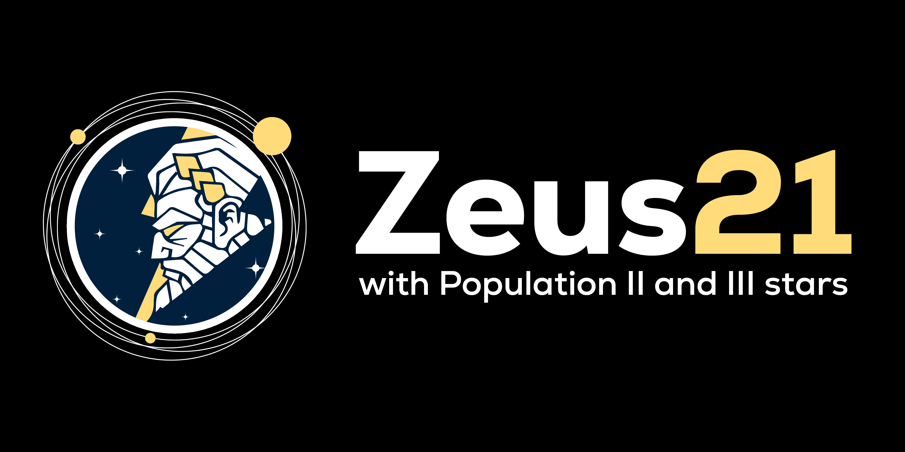
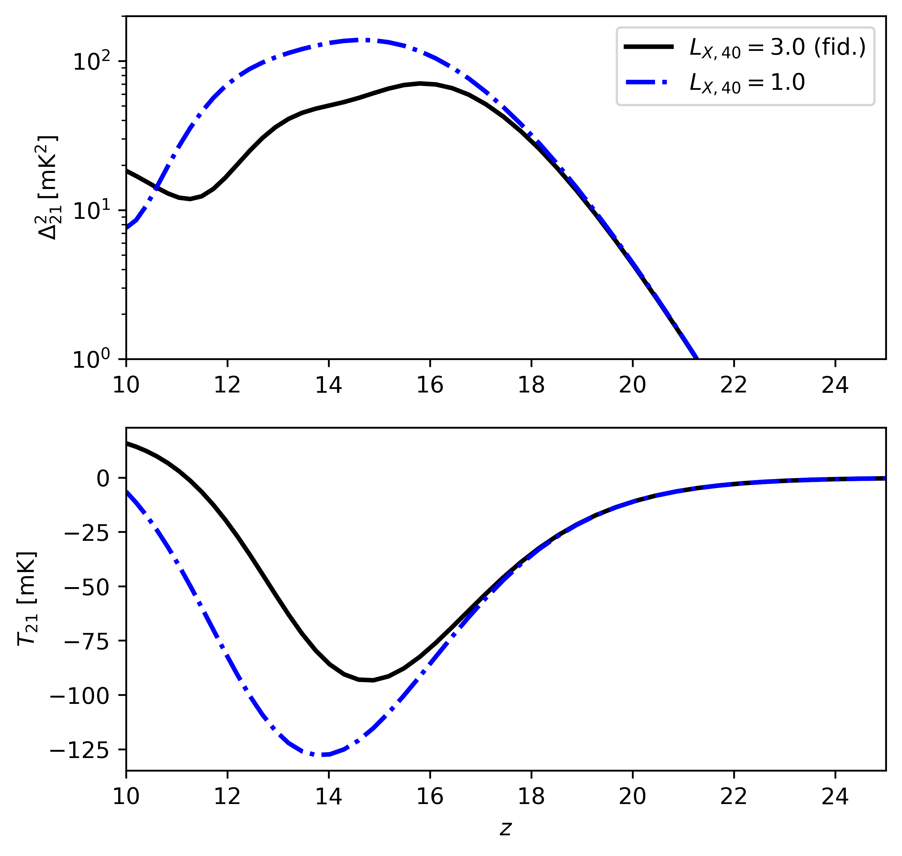

<p align="center">

</p>

# Zeus21: Lightning-fast simulations of cosmic dawn

Zeus21 encodes the effective model for the 21-cm power spectrum and global signal from [Muñoz 2023a](https://arxiv.org/abs/2302.08506). The goal is to capture all the nonlocal and nonlinear physics of cosmic dawn in a light and fully Pythonic code. Zeus21 takes advantage of the approximate log-normality of the star-formation rate density (SFRD) during cosmic dawn to compute the 21-cm power spectrum analytically. It agrees with more expensive semi-numerical simulations to roughly 10% precision, but has comparably negligible computational cost (~ s) and memory requirements. Now Zeus21 can also predict galaxy UV luminosity functions (UVLFs) and their linear clustering (galaxy bias) at any z, see [Muñoz et al. 2023b](https://arxiv.org/abs/2306.09403) for the implementation and application to JWST. Now Zeus21 includes Population III stars with inhomogeneous Lyman-Werner feedback and relative velocities (with their fluctuations), as described in [Cruz et al. 2024](https://arxiv.org/abs/2407.18294).

Zeus21 (Zippy Early-Universe Solver for 21-cm) pairs well with data from [HERA](https://reionization.org/), but can be used for any 21-cm inference or prediction. Current capabilities include finding the 21-cm power spectrum (at a broad range of k and z), the global signal, IGM temperatures (Tk, Ts, Tcolor), neutral fraction xHI, Lyman-alpha fluxes, and the evolution of the SFRD; all across cosmic dawn z=5-35. Zeus21 can use three different astrophysical models, one of which emulates 21cmFAST, and can vary the cosmology through CLASS. 

If you want to get started I recommend checking the Jupyter tutorials in `docs/`. Full documentation in [ReadTheDocs](https://zeus21.readthedocs.io/en/latest/), more coming soon. Here is an example power spectrum (at k=0.3/Mpc) and global signal as a function of redshift, for two cases of X-ray luminosity. You can run it yourself with the tutorial included!

<p align="center">

</p>

Currently you can find tutorials for:

<ul>
  <li>Basics, running and plotting 21-cm power spectra and global signals. </li>
  <li>UVLFs, comparing to HST and JWST predictions at high redshifts. </li>
  <li>PopIII stars, and how they affect the cosmic-dawn 21-cm signal. </li>
</ul>

## Installation

You can download and install this package by doing:

```
git clone https://github.com/julianbmunoz/zeus21.git zeus21
cd zeus21/
pip install .
```

that should take care of all dependencies (remember to work in your favorite conda env). If you have issues with cache'd versions of packages you can add `--no-cache-dir` at the end of `pip install .`. 

**NOTE:** You may run into problems when pip-installing `classy` (the Python wrapper of `CLASS`). If so, their installation guide is [here](https://github.com/lesgourg/class_public/wiki/Installation), but in short the steps are:

```
git clone https://github.com/lesgourg/class_public.git class
cd class/
make
cd python/
python setup.py install --user
```

(modifying the Makefile to your `gcc` as needed)

## Citation

If you find this code useful please cite:

[An Effective Model for the Cosmic-Dawn 21-cm Signal](https://arxiv.org/abs/2302.08506)

and include a link to [this Github](https://github.com/JulianBMunoz/Zeus21).

If you use the UVLF module please cite:

[Breaking degeneracies in the first galaxies with clustering](https://arxiv.org/abs/2306.09403)

And if you use relative velocites, Lyman-Werner feedback, or Population III stars please cite:

[The First Billion Years in Seconds: An Effective Model for the 21-cm Signal with Population III Stars](https://arxiv.org/abs/2407.18294).

