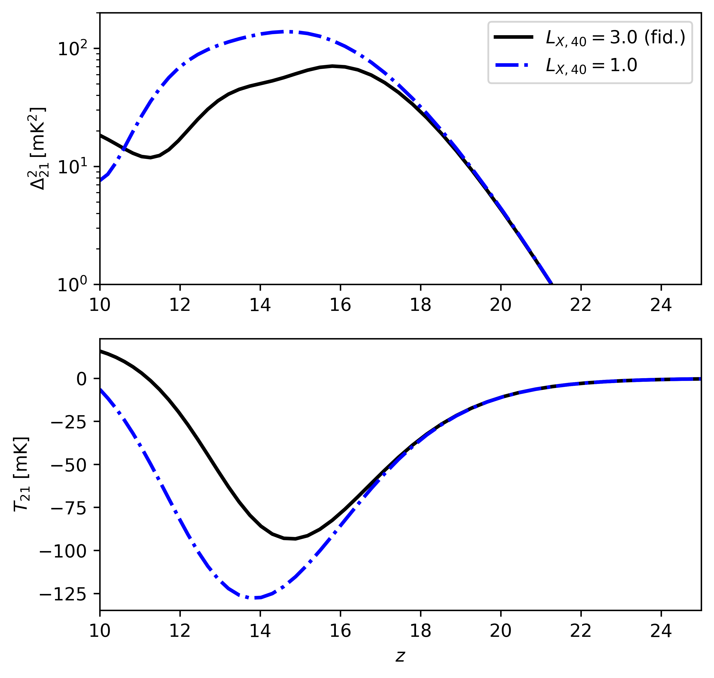

=========
Tutorials
=========

If you want to get started, we recommend checking the Jupyter tutorials.  

Currently you can find tutorials for:

.. toctree::
   :maxdepth: 1
   :caption: Tutorials

   tutorials/Tutorial_Zeus21_21cm
   tutorials/Tutorial_Zeus21_UVLFs
   tutorials/Tutorial_Zeus21_PopIIandIII_Fiducial
   tutorials/Tutorial_Zeus21_Maps

Here is an example power spectrum (at k=0.3/Mpc) and global signal as a function of redshift, for two cases of X-ray luminosity. 
You can run it yourself with the included tutorial!

